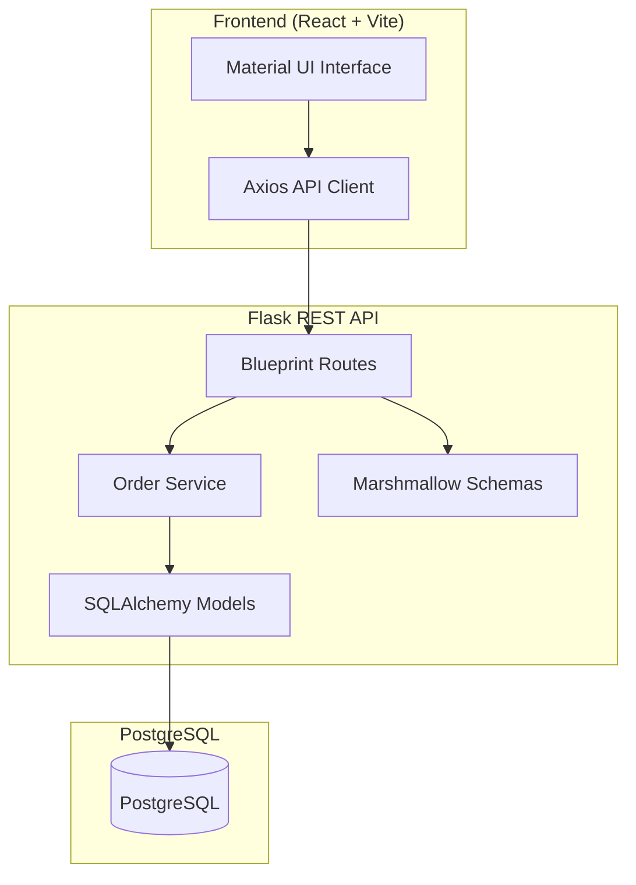

# AETHER | Enterprise Inventory & Order Management System

Aether is a production-ready full-stack inventory and order management platform built using React, Flask, and PostgreSQL. The application enables organizations to manage products, customers, inventory levels, and transactional sales orders with strong consistency guarantees and a modern glassmorphic user experience.

---

## 🌐 Live Application

### Frontend (Netlify)

https://incredible-marzipan-734f77.netlify.app/

### Backend API (Render)

https://aether-04c9.onrender.com

### Docker Hub Backend Image

https://hub.docker.com/r/amrit7477/aether-backend

---

## 🏛️ System Architecture



---

## ✨ Key Features

### Inventory Management

* Product catalog management
* SKU-based inventory tracking
* Stock quantity monitoring
* Low-stock alerts

### Customer Management

* Customer profile creation
* Email uniqueness validation
* Customer order history

### Order Management

* Multi-item order creation
* Real-time stock validation
* Automatic inventory deduction
* Transaction rollback protection

### Dashboard Analytics

* Total products
* Total customers
* Total orders
* Low-stock product monitoring

### Enterprise Reliability

* PostgreSQL transactional integrity
* Row-level locking using `with_for_update`
* Centralized error handling
* CORS security policies
* Production-ready REST APIs

---

## 🛠️ Technology Stack

### Backend

* Python 3.12
* Flask
* Flask-SQLAlchemy
* Flask-Migrate
* Marshmallow
* Gunicorn

### Frontend

* React 18
* Vite
* React Router
* Axios
* Material UI (MUI)
* Canvas Confetti

### Database

* PostgreSQL (Production)
* SQLite (Testing)

### DevOps

* Docker
* Docker Compose
* Nginx
* Docker Hub

### Hosting

* Frontend: Netlify
* Backend: Render
* Database: Render PostgreSQL

---

## ⚙️ Environment Configuration

### Backend (.env)

```env
FLASK_ENV=production
FLASK_APP=run.py

SECRET_KEY=<secure-secret-key>

DATABASE_URL=<postgresql-database-url>

ALLOWED_ORIGINS=https://incredible-marzipan-734f77.netlify.app
```

### Frontend (.env)

```env
VITE_API_URL=https://aether-04c9.onrender.com
```

---

## 🐳 Docker Setup

### Run Entire Stack

```bash
docker-compose up --build
```

Services:

| Service    | Port |
| ---------- | ---- |
| Frontend   | 80   |
| Backend    | 5000 |
| PostgreSQL | 5432 |

---

## 💻 Local Development

### Backend

```bash
cd backend

python -m venv venv

# Windows
venv\Scripts\activate

pip install -r requirements.txt

python run.py
```

Backend:

```text
http://localhost:5000
```

### Frontend

```bash
cd frontend

npm install

npm run dev
```

Frontend:

```text
http://localhost:5173
```

---

## 🧪 Testing

```bash
cd backend

python -m pytest
```

The test suite validates:

* Model constraints
* API behavior
* Order transactions
* Inventory calculations
* Schema validation

---

## 📖 API Endpoints

### Dashboard

| Method | Endpoint   |
| ------ | ---------- |
| GET    | /dashboard |

### Products

| Method | Endpoint       |
| ------ | -------------- |
| GET    | /products      |
| POST   | /products      |
| GET    | /products/<id> |
| PUT    | /products/<id> |
| DELETE | /products/<id> |

### Customers

| Method | Endpoint        |
| ------ | --------------- |
| GET    | /customers      |
| POST   | /customers      |
| GET    | /customers/<id> |
| DELETE | /customers/<id> |

### Orders

| Method | Endpoint     |
| ------ | ------------ |
| GET    | /orders      |
| POST   | /orders      |
| GET    | /orders/<id> |
| DELETE | /orders/<id> |

---

## 🚀 Deployment

### Backend Deployment (Render)

Build Command:

```bash
pip install -r backend/requirements.txt
```

Start Command:

```bash
gunicorn --bind 0.0.0.0:$PORT --chdir backend run:app
```

Production URL:

```text
https://aether-04c9.onrender.com
```

### Frontend Deployment (Netlify)

Build Command:

```bash
npm run build
```

Publish Directory:

```text
dist
```

Environment Variable:

```env
VITE_API_URL=https://aether-04c9.onrender.com
```

Production URL:

```text
https://incredible-marzipan-734f77.netlify.app/
```

---

## 📦 Docker Hub

### Backend Image

Repository:

```text
amrit7477/aether-backend:latest
```

Docker Hub:

```text
https://hub.docker.com/r/amrit7477/aether-backend
```

Pull Image:

```bash
docker pull amrit7477/aether-backend:latest
```

---

## 📸 Application Modules

### Dashboard

Provides inventory insights, KPI cards, and low-stock alerts.

### Products

Manage catalog items, pricing, stock levels, and SKU information.

### Customers

Maintain customer records and account information.

### Orders

Create transactional orders with automatic stock deductions and inventory synchronization.

---

## 👨‍💻 Author

Amrit Bharti

Full Stack Developer

Tech Stack:
Python • Flask • React • PostgreSQL • Docker 
